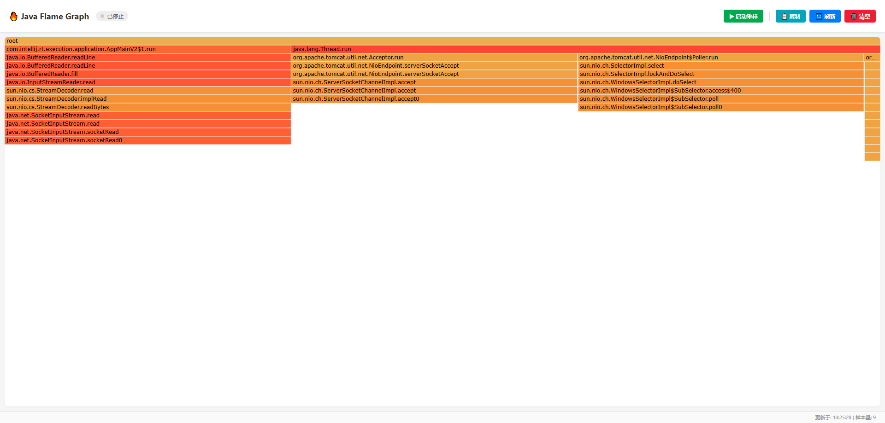

# BSFC Tech FlameGraph

[](#)
[](#)
[](#)

轻量级 Java 方法级火焰图采集工具，适用于 Spring Boot 应用程序的性能分析。

## 🌟 特性

- **零侵入性**: 基于 Spring Boot Starter 机制，引入依赖即可自动装配
- **实时监控**: 提供 Web UI 界面，实时展示方法级别的性能热点
- **低开销设计**: 使用守护线程进行采样，不影响主业务流程
- **安全防护**: 内存保护机制防止采样数据无限增长
- **灵活配置**: 支持多种参数配置，适应不同场景需求
- **可视化展示**: 集成 D3.js 火焰图展示，直观呈现性能瓶颈

## 🏗️ 项目结构

```
bsfc-tech-flamegraph
├── flamegraph-spring-boot-starter      # 核心组件：自动装配 + 采集引擎 + UI
├── flamegraph-spring-boot-starter-demo # 示例工程：模拟业务负载
└── 技术方案.md                         # 详细技术文档
```

## 🚀 快速开始

### 1. 添加依赖

在您的 Spring Boot 项目中添加以下依赖：

```xml

<dependency>
    <groupId>tech.bsfc</groupId>
    <artifactId>flamegraph-spring-boot-starter</artifactId>
    <version>1.0.0</version>
</dependency>
```

### 2. 配置参数

在 `application.yml` 中添加配置：

```yaml
flamegraph:
  enabled: true              # 是否启用火焰图功能，默认为 true
  sample-interval: 50        # 采样间隔(ms)，建议 >= 20ms，默认为 50ms
  max-depth: 100             # 堆栈最大深度，默认为 100
  max-stored-stacks: 10000   # 最大允许存储的堆栈路径数量，默认为 10000
```

### 3. 访问火焰图界面

启动应用后，访问以下地址查看火焰图：

```
http://localhost:8080/flamegraph/index.html
```

## 🎯 使用指南

### 控制采样

火焰图提供了几个 API 接口来控制采样过程：

- `GET /api/v1/flamegraph` - 获取当前采样数据
- `POST /api/v1/flamegraph/start` - 开始采样
- `POST /api/v1/flamegraph/stop` - 停止采样
- `POST /api/v1/flamegraph/reset` - 清空采样数据
- `GET /api/v1/flamegraph/status` - 获取采样状态

在 Web UI 中也有对应的按钮可以直接操作。

### 查看结果

1. 点击 "启动采样" 开始收集数据
2. 对应用执行一些负载操作（如访问相关接口）
3. 点击 "刷新" 或等待自动刷新查看火焰图
4. 可以通过点击火焰图中的节点查看详情
5. 使用 "清空" 按钮清除历史数据重新开始

## ⚙️ 技术原理

### 采样机制

该工具通过定时采样线程获取应用程序的所有线程堆栈信息：

1. 使用 `ThreadMXBean.dumpAllThreads()` 获取所有线程的堆栈信息
2. 过滤出处于 `RUNNABLE` 和 `BLOCKED` 状态的线程
3. 将堆栈信息转换为折叠格式（collapsed stack format）
4. 使用 `ConcurrentHashMap` + `LongAdder` 统计各堆栈出现次数

### 性能考量

- **优点**: 纯 Java 实现，跨平台，无需额外的 agent 或 JVM 参数
- **缺点**: 高频采样（<10ms）可能影响应用吞吐量，因为 `dumpAllThreads()` 会触发全局安全点
- **建议**: 仅在开发/测试环境开启，生产环境中应谨慎使用

## 🔧 配置说明

| 配置项                          | 类型      | 默认值   | 说明                  |
|------------------------------|---------|-------|---------------------|
| flamegraph.enabled           | boolean | true  | 是否启用火焰图功能           |
| flamegraph.sample-interval   | long    | 50    | 采样间隔（毫秒），建议 >= 20ms |
| flamegraph.max-depth         | int     | 100   | 堆栈最大深度              |
| flamegraph.max-stored-stacks | int     | 10000 | 内存保护：最大允许存储的堆栈路径数量  |

## 📊 界面预览

火焰图界面提供了直观的数据可视化功能：



主要功能包括：

- 实时火焰图展示
- 采样控制（开始/停止）
- 数据刷新和清空
- 数据复制功能

## 🛡️ 安全特性

1. **内存保护**: 通过 [max-stored-stacks](#) 配置项限制存储的堆栈数量，防止内存溢出
2. **守护线程**: 采样线程设置为守护线程，不会阻止 JVM 正常退出
3. **异常隔离**: 采样过程中的异常被捕获，不会影响主业务流程
4. **权限控制**: 通过 Spring Boot 的 [ConditionalOnProperty](#) 注解控制是否启用

## 📚 相关文档

- [技术方案文档](docs/技术方案.md) - 详细的技术实现方案
- [API 文档](#) - 待完善

## 📝 使用示例

参见 [flamegraph-spring-boot-starter-demo](flamegraph-spring-boot-starter-demo) 模块中的示例：

```java

@RestController
public class SimulationController {

    @GetMapping("/work")
    public String heavyWork() {
        long start = System.currentTimeMillis();
        // 运行 500ms 的空循环计算
        while (System.currentTimeMillis() - start < 500) {
            Math.tan(new Random().nextDouble());
            subMethodA();
        }
        return "Work Done";
    }

    private void subMethodA() {
        if (new Random().nextInt(100) > 50) {
            subMethodB();
        }
    }

    private void subMethodB() {
        Math.sin(new Random().nextDouble());
    }
}
```

## ⚠️ 注意事项

1. 生产环境中请根据实际情况调整采样频率，避免对系统性能造成影响
2. 不建议长时间开启采样功能，特别是在高并发场景下
3. 采样数据存储在内存中，注意监控内存使用情况
4. 当前版本仅支持 Spring Boot 2.7.x，后续会适配 Spring Boot 3.x

## 📄 License

本项目采用 MIT License 许可证，详情请见 [LICENSE](LICENSE) 文件。

## 👥 联系我们

如有问题或建议，请提交 Issue 或联系项目维护者。